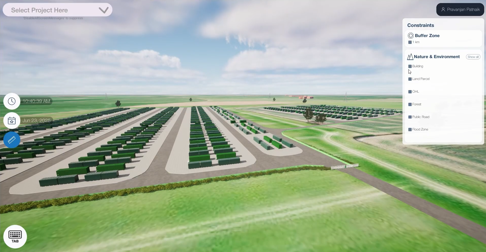

# PowerAndEnergy-DigitalTwin

Transforming traditional land mapping into a powerful **interactive experience**, our **Land Parcel & Asset Visualization (Power & Energy)** platform blends **survey-grade accuracy** with **real-time 3D visualization**, empowering professionals to make smarter, faster decisions with complete spatial context.  

What if you could **explore land parcels like a video game**—but with the **real-world accuracy** that engineers and surveyors demand?  
What if you could **combine the reach of global satellite maps** with the **creative control of a city-building simulator**, tailored for engineering workflows?  

We’re leveraging **cutting-edge emerging technologies** — **GIS Tools (Cesium)**, **CityEngine**, and **Unreal Engine** — working seamlessly in the **cloud**. This combination processes complex geospatial datasets and delivers highly optimized 3D models through **Pixel Streaming**, enabling an **immersive, real-time experience** in your browser without taxing your hardware.  

---

## 📑 What's Inside This Repo
- Workflow Summary  
- GIS Processing  
- CityEngine Integration  
- 3D Modeling & Optimization  
- Unreal Engine Setup & Level Design  
- UI & Controls  
- Interactive Features  
- Testing & Deployment  

---

## 🌍 What This Tool Actually Does
This platform provides a **clear, detailed view of land development** — combining **AR/VR-ready visuals**, **live data updates**, and **precise geospatial accuracy**.  

- Converts messy **GeoJSON & GIS data** into accurate **3D models** with Unreal Engine  
- Runs **smoothly in-browser** through **Pixel Streaming**  
- Accessible **anytime, anywhere, on any device**  
- Eliminates the need for expensive hardware  

---

## 🔄 How We Actually Built This Thing

1. **Data Wrangling** → Cleaned & validated raw GeoJSON; added 3D marketplace assets  
2. **GIS Processing** → Converted to SLPK/SHP, standardized in Web Mercator, prepared layers with QGIS  
3. **CityEngine Integration** → Imported GIS data, generated SLPK/FBX models, integrated via ArcGIS Unreal plugin  
4. **3D Model Optimization** → Reduced polygons by **up to 95%** while maintaining fidelity for smooth performance  
5. **Unreal Engine** →  
   - Developed GIS-integrated Unreal project  
   - Imported optimized models, applied non-intrusive materials  
   - Placed assets with exact GIS coordinates  
   - Enhanced with spline-driven roads, fences, foliage  
6. **UI & Controls** → Built intuitive UIs (Unreal Blueprints + Figma), enabled parcel selection & layer toggling  
7. **Interactive Features** → Added real-world measurement tools, asset toggling, dynamic interactions  
8. **Testing & Deployment** → Validated cross-platform, deployed as **Pixel Streaming app** with cloud backend  

---

## 🎯 Technology Stack

### 🔹 Backend
- GIS / GIS Data Processing (GeoJSON, SHP, SLPK)  
- CityEngine  
- QGIS  
- C++  
- Postman  
- Cloud Streaming (**Pixel Streaming, Wagon Platform**)  

### 🔹 Frontend
- Unreal Engine (Blueprints, GIS plugin)  
- Blender  
- Figma  

---

## ✅ Outcome
Our Land Parcel & Asset Visualization (Power&Energy) platform delivers an immersive, cloud-powered, AR/VR-ready geospatial visualization solution that merges GIS data, interactive 3D assets, and engineering precision without compromising on performance or accessibility.
Cloud streaming solves the classic “can it run on my laptop?” problem — users access it instantly anywhere, on any device, enabling real land management, asset monitoring, and planning through an intuitive, engaging interface.

---
